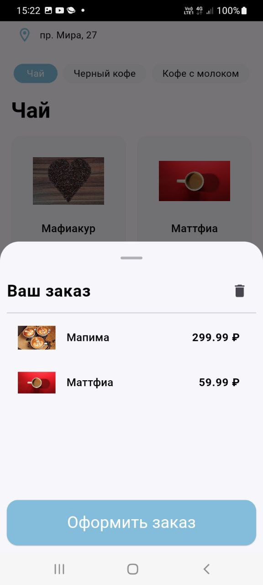

# flutter_coffee_shop

As part of the laboratory work on Flutter technology, it was proposed to develop an application for a coffee shop

  
  
  

  
  
  

# Technologies

- Flutter version 3.19.6, channel stable
	- Framework revision 54e66469a9 (6 weeks ago), 2024-04-17 13:08:03 -0700
	- Engine revision c4cd48e186
	- Dart version 3.3.4
	- DevTools version 2.31.1
- VS Code version 1.89.1
	- Flutter extension version 3.88.0
- Windows 10
- Tested on Samsung SMA225F 

# Launch

- Installing [flutter](https://flutter.dev/docs/get-started/install) and [Android Studio](https://developer.android.com/studio/install) or [VS Code](https://code.visualstudio.com/docs/setup/setup-overview) with the Flutter plugin
- Click on the "Code" and select "Download ZIP" and unzip it
- Open Android Studio or VS Code and open folder
- Choose an emulator or device
- Run or F5
- Problem solving:
    - flutter pub upgrade --major-versions
    - flutter pub get
    - flutter run

# App's features

## LAB 1 Menu Screen
- product categories are scrolled horizontally
- when scrolling, the categories change and navigation to the selected category takes place
- when you click on the category button, it becomes active, and the content scrolls to the section with the selected category
- each product is a card with a photo, description and price of the product
- the width of the card is selected automatically 
- when you click on the product price button, a counter appears, a certain amount of goods is selected (from 1 to 10), at 0 the button returns to its original state

  

## LAB 2 Order Screen
- added a shopping cart button that appears when adding an item
- clicking on the shopping cart button opens the BottomSheet with the order items
- clicking on the deleting button clears and closes the BottomSheet
- clicking on the "Place an order" sends a post request
- if the post request fails, the SnackBar is displayed with an error
- data is received from the server

  
  
  

## LAB 3 Data Base
- data is saved to the DB after downloading from the API
- data is taken from the DB if there is no access to the network
- data from the DB is paginated
- created repositories and data sources, its share the functionality of receiving and saving data

## LAB 4 Map Screen
- added location button on MenuScreen
- a click opens MapScreen
- the selected location is recorded using shared_preferences
- if the location is not selected, the first one is displayed
- the user's location is determined on MapScreen
- when you select the address, you return on the MenuScreen and the button displays the selected address
- created widgets, models, bloc for screens with map and addresses
- locations is saved to the DB after downloading from the API, created repositories and data sources for this

  
  
  
  
  

## LAB 5 Push Notifications
- created FCM project, firebase configuration
- initialized FCM
- got FCM token
- added local notification with icon
- received test push notification, sent from firebase
- added dummy notification 

  
  
  

## LAB 6 Release
- UI fix: order bottomsheet, button extension for full cost 
- launch icon
- localization (added EN)
- README
- apk

# Known issues
- API key for MapKit is publicly available
- When switching categories, cards take a long time to load
- Strings in dummy notification are not localized
